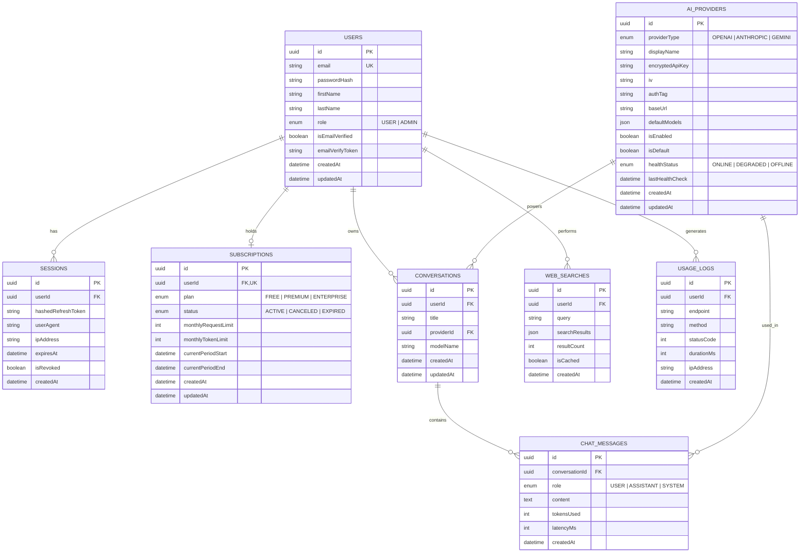

# EchoGPT Backend REST API - Production Architecture & Implementation Plan

## 1. Executive Summary & Architecture Overview
**EchoGPT Backend** is a production-grade REST API backend built to power the EchoGPT Chrome Extension. It facilitates unified multi-provider AI chat (OpenAI, Claude, Google Gemini), AI-assisted web searching, flexible subscription tiers, secure API key vaulting, and administrative telemetry.

### Architectural Principles
* **Framework**: NestJS (TypeScript) with Modular Clean Architecture.
* **Database & ORM**: PostgreSQL with Prisma ORM (Type-safe migrations, high developer ergonomics, schema clarity).
* **Security & Auth**: Dual-token JWT (Short-lived Access Token + Rotating Refresh Token), Argon2 hashing, AES-256-GCM encryption for user/admin AI provider keys, Helmet security headers, rate limiting (NestJS Throttler).
* **Documentation**: Full OpenAPI (Swagger) v3 specs with automated DTO reflection, request/response models, and Bearer Auth.
* **Infrastructure**: Docker & Docker Compose setup (NestJS App + PostgreSQL 16 + Redis for caching/rate-limiting).

---

## 2. System Architecture & Directory Structure

```
echogpt-backend/
├── prisma/
│   ├── schema.prisma                  # Data models, relations & indexes
│   ├── migrations/                    # Automated SQL migration files
│   └── seed.ts                        # Initial seed data (Admin, default AI providers, plans)
├── src/
│   ├── common/                        # Shared cross-cutting concerns
│   │   ├── constants/                 # Roles, Plan tiers, Provider types
│   │   ├── decorators/                # @CurrentUser(), @Roles(), @Public()
│   │   ├── filters/                   # HttpExceptionFilter (Standardized API responses)
│   │   ├── guards/                    # JwtAuthGuard, RolesGuard, SubscriptionThrottlerGuard
│   │   ├── interceptors/              # LoggingInterceptor, TransformResponseInterceptor
│   │   ├── pipes/                     # ValidationPipe configs
│   │   └── utils/                     # CryptoUtil (AES-256-GCM encryption/decryption)
│   ├── config/                        # Env validation (Joi or @nestjs/config)
│   ├── modules/
│   │   ├── auth/                      # Registration, Login, Refresh, Password Hashing
│   │   │   ├── dto/
│   │   │   ├── strategies/            # JwtStrategy, RefreshTokenStrategy
│   │   │   ├── auth.controller.ts
│   │   │   └── auth.service.ts
│   │   ├── users/                     # Profile, Password change, User management
│   │   ├── subscriptions/             # Plan rules, Usage tracking, Quota guards
│   │   ├── ai-providers/              # Multi-AI Registry, Key encryption, Health checks
│   │   │   ├── adapters/              # Provider implementations (OpenAI, Anthropic, Gemini)
│   │   │   ├── ai-providers.controller.ts
│   │   │   └── ai-providers.service.ts
│   │   ├── chat/                      # Chat orchestration, Conversation history, SSE Streaming
│   │   │   ├── dto/
│   │   │   ├── chat.controller.ts
│   │   │   └── chat.service.ts
│   │   ├── web-search/                # AI Web search, DuckDuckGo/Tavily adapter, Search history & cache
│   │   ├── admin/                     # Analytics dashboard, User moderation, Audit logs
│   │   └── health/                    # Terminus health checks (DB, Memory, Disk)
│   ├── prisma/                        # PrismaService & PrismaModule
│   ├── app.module.ts
│   └── main.ts                        # Bootstrap, Swagger setup, Global pipes/filters
├── test/                              # E2E test suites
├── docker-compose.yml                 # Local dev orchestration (Postgres + Redis)
├── Dockerfile                         # Production multi-stage Docker build
├── .env.example                       # Full environment variable template
├── package.json
└── tsconfig.json
```

---

## 3. Database Schema Design (PostgreSQL / Prisma)

### Core Entities & Relationships



---

## 4. Feature Specifications & API Endpoints

### 4.1 Authentication Module (`/api/v1/auth`)
* `POST /api/v1/auth/register` - Create account with validation and auto-assign FREE subscription.
* `POST /api/v1/auth/login` - Authenticate via email & password, issue JWT Access (15m) + Refresh (7d) tokens.
* `POST /api/v1/auth/refresh` - Rotate refresh token & issue new access token.
* `POST /api/v1/auth/logout` - Invalidate current session refresh token.
* `GET /api/v1/auth/verify-email` - Email verification flow with secure token (Bonus feature).

### 4.2 User Management Module (`/api/v1/users`)
* `GET /api/v1/users/me` - Fetch authenticated user profile and subscription metadata.
* `PATCH /api/v1/users/me` - Update profile (name, avatar, preferences).
* `POST /api/v1/users/me/change-password` - Validate current password and set new hashed password.
* `DELETE /api/v1/users/me` - Soft/hard account deletion and session purge.

### 4.3 Subscription & Usage Module (`/api/v1/subscriptions`)
* `GET /api/v1/subscriptions/status` - Current plan, active limits, billing period dates.
* `GET /api/v1/subscriptions/usage` - Daily/Monthly requests used, tokens consumed, remaining quotas.
* `POST /api/v1/subscriptions/upgrade` - Upgrade plan simulation (Free $\to$ Premium).
* `POST /api/v1/subscriptions/downgrade` - Downgrade plan or cancel renewal.
* *Guard Integration*: `SubscriptionThrottlerGuard` blocks chat/search requests when usage quotas are exceeded.

### 4.4 AI Provider Management (`/api/v1/ai-providers`)
* Supports **OpenAI** (GPT-4o, GPT-3.5-Turbo), **Anthropic** (Claude 3.5 Sonnet, Claude 3 Opus), **Google Gemini** (Gemini 1.5 Pro, Flash).
* `GET /api/v1/ai-providers` - List active providers and available models for Chrome Extension.
* `POST /api/v1/admin/ai-providers` (Admin) - Add provider with encrypted API key storage (AES-256-GCM).
* `PATCH /api/v1/admin/ai-providers/:id` (Admin) - Update provider credentials, models, status.
* `DELETE /api/v1/admin/ai-providers/:id` (Admin) - Remove provider.
* `PATCH /api/v1/admin/ai-providers/:id/toggle` (Admin) - Enable/disable provider.
* `PATCH /api/v1/admin/ai-providers/:id/default` (Admin) - Select global default provider.
* `GET /api/v1/admin/ai-providers/:id/health` - Ping provider API to verify credentials & latency.

### 4.5 Chat API Module (`/api/v1/chat`)
* `POST /api/v1/chat/message` - Send prompt, select provider & model, receive full AI response.
* `GET /api/v1/chat/stream` - **Streaming Response (Bonus)** via Server-Sent Events (SSE) for low-latency streaming in the Chrome Extension popup.
* `GET /api/v1/chat/conversations` - Paginated conversation threads.
* `GET /api/v1/chat/conversations/:id` - Full message history of a conversation.
* `DELETE /api/v1/chat/conversations/:id` - Delete conversation thread.

### 4.6 Web Search API Module (`/api/v1/search`)
* `POST /api/v1/search/query` - Perform search with result summarization.
* `GET /api/v1/search/history` - User's search history with pagination.
* `GET /api/v1/search/recent` - Top 5 recent queries.
* `GET /api/v1/search/suggestions` - Auto-complete search suggestions.
* *Caching (Bonus)*: In-memory/Redis TTL caching (1 hour) to save network hops and API quotas.

### 4.7 Admin Panel APIs (`/api/v1/admin`)
* `GET /api/v1/admin/analytics/dashboard` - Active users, total chats, search queries, plan distributions.
* `GET /api/v1/admin/users` - Paginated user list with role filtering and account status.
* `PATCH /api/v1/admin/users/:id/role` - Elevate or demote user roles.
* `GET /api/v1/admin/analytics/usage-logs` - Real-time audit logs of API endpoints, status codes, latency.
* `GET /api/v1/admin/health` - Terminus health check (Database, Memory Heap, System load).

---

## 5. Security & Best Practices
1. **API Key Vault**: Provider API keys are never stored as plaintext. We implement AES-256-GCM with a secret encryption key and initialization vector (IV) stored in `.env`.
2. **Password Security**: Argon2id hashing with unique salts.
3. **JWT Guarding & Revocation**: Access tokens checked via stateless JwtStrategy; Refresh tokens stored as SHA-256 hashes in the `Session` table, enabling instant session revocation.
4. **Validation & Sanitization**: Strict `ValidationPipe` with `whitelist: true`, `forbidNonWhitelisted: true`, and DTO transformation.
5. **Rate Limiting**: NestJS `@nestjs/throttler` to prevent brute force on `/auth` and API abuse on `/chat`.
6. **OpenAPI / Swagger Documentation & CLI Plugin**:
   * Interactive Swagger UI at `/docs` with JWT Bearer authentication support and request/response schema specifications.
   * **Pro-tip Implementation**: Enable `@nestjs/swagger` plugin in `nest-cli.json` with `classValidatorShim: true` and `introspectComments: true`. This automatically introspects TypeScript DTOs, JSDoc comments, and `class-validator` rules without manually annotating every single property with `@ApiProperty()`.

```json
{
  "collection": "@nestjs/schematics",
  "sourceRoot": "src",
  "compilerOptions": {
    "deleteOutDir": true,
    "plugins": [
      {
        "name": "@nestjs/swagger",
        "options": {
          "classValidatorShim": true,
          "introspectComments": true
        }
      }
    ]
  }
}
```

---

## 6. Implementation Roadmap & Milestones

| Milestone | Phase | Description |
|---|---|---|
| **Phase 1** | **Setup & Foundation** | Initialize NestJS project, configure TypeScript, ESLint, Prisma ORM, PostgreSQL connection, Docker Compose, and environment validation. |
| **Phase 2** | **Data Modeling & Seed** | Define Prisma schema (Users, Sessions, Subscriptions, Providers, Chats, Searches, Logs), run migrations, write initial seed script. |
| **Phase 3** | **Auth & User Management** | Implement dual-token JWT, Refresh token rotation, Argon2, Guards (`JwtAuthGuard`, `RolesGuard`), and User CRUD. |
| **Phase 4** | **Subscriptions & Quota Guard** | Implement Free/Premium tiers, request limits, usage tracking interceptor, and remaining request API. |
| **Phase 5** | **AI Provider System** | Implement AES-256-GCM encryption service, provider adapters (OpenAI, Anthropic, Gemini), dynamic model resolution, and health-checks. |
| **Phase 6** | **Chat & Streaming Engine** | Implement chat controller, conversation history, and Server-Sent Events (SSE) streaming endpoint. |
| **Phase 7** | **Web Search Engine** | Implement search query execution, caching layer, suggestions, and search history. |
| **Phase 8** | **Admin Analytics & System Health** | Build admin statistics, user management endpoints, request audit logging, and Terminus health indicators. |
| **Phase 9** | **Swagger, Docker & Final Polish** | Configure comprehensive Swagger documentation with examples, `.env.example`, README guide, and Docker production verification. |
